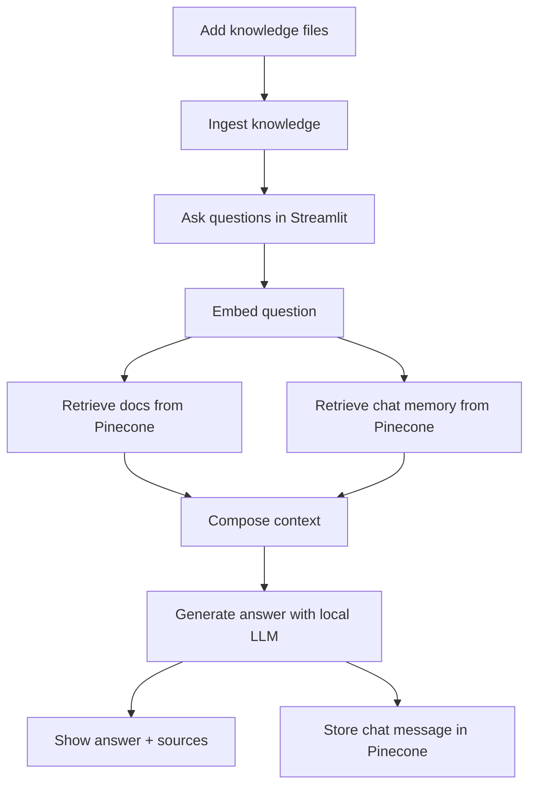

# Project Workflow

## Diagram

1. Add knowledge files
   - Put .txt or .md files into the data folder (or any folder you choose).
2. Ingest knowledge
   - Run the ingest script to create embeddings and store them in Pinecone.
3. Ask questions
   - Open the Streamlit app and type a question.
4. Retrieve context
   - The app embeds your question and fetches relevant document chunks from Pinecone.
5. Use memory
   - Relevant chat history is retrieved from Pinecone and used as conversation memory.
6. Generate answer
   - The local LLM receives question + context + memory and returns a response.
7. Show sources
   - The UI shows the answer and source snippets.
