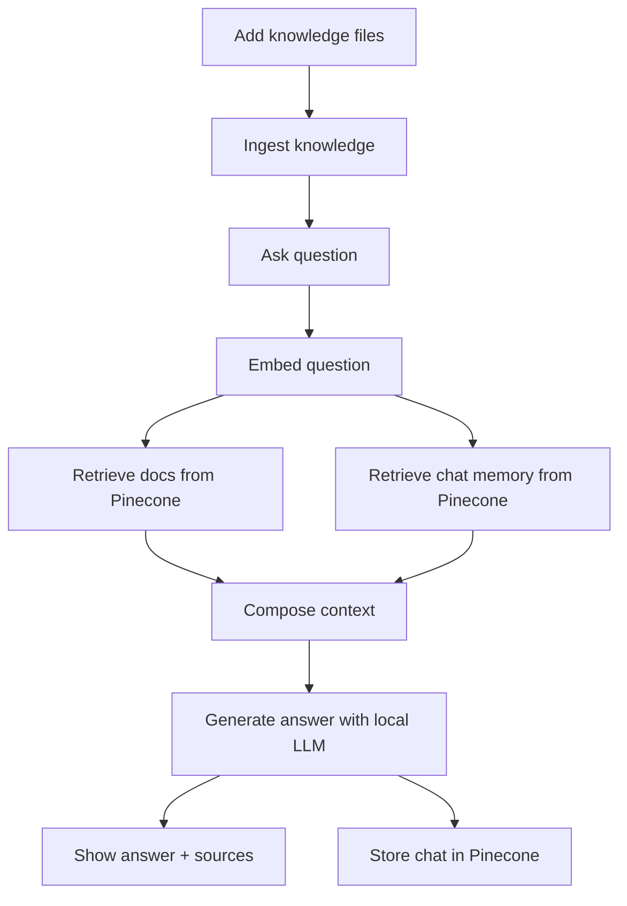

# Build Your Own Jarvis

## Exercise
Programming Assignment: Build Your Own Personal AI Assistant
Tool: Virtual Studio, Co-pilot
Objective: Design an AI-powered feature for a SaaS product — your own Jarvis for the enterprise.

## Your Task (Solution Summary)
This project delivers a personal assistant powered by a self-hosted LLM (Ollama-compatible LLaMA) that:
- Understands user queries
- Retrieves relevant context from Pinecone (vector database)
- Uses chat history as memory
- Responds through a Streamlit chatbot UI

## What This Project Provides
- Streamlit chatbot interface
- Pinecone-backed knowledge retrieval
- Local LLM responses (self-hosted)
- Chat memory stored and reused from Pinecone
- Voice input (speech-to-text) and voice output (text-to-speech)
- Simple ingestion pipeline for .txt and .md documents

## Project Workflow


## Requirements
- Python 3.10+
- Local LLM server (Ollama recommended)
- Pinecone API key and index
- FFmpeg installed (required by Whisper for voice input)

## Install & Run (GitHub)
1) Clone the repo
```bash
git clone https://github.com/lokesh0221/Jarvis_Diligent.git
cd Jarvis_Diligent
```

2) Create and activate a virtual environment
```bash
python -m venv .venv
.venv\Scripts\activate
```

3) Install dependencies
```bash
pip install -r requirements.txt
```

4) Configure environment variables
Copy [\.env.example](.env.example) to .env and set values:
```bash
copy .env.example .env
```

Key variables:
- PINECONE_API_KEY
- PINECONE_INDEX
- PINECONE_CLOUD
- PINECONE_REGION
- PINECONE_NAMESPACE
- CHAT_NAMESPACE
- OLLAMA_HOST
- LLM_MODEL

5) Ingest documents
```bash
python scripts/ingest.py --path data
```

6) Run the Streamlit app
```bash
streamlit run app/streamlit_app.py
```

## Usage Notes
- Adjust model and retrieval settings in the Streamlit sidebar.
- Chat memory is stored in CHAT_NAMESPACE and reused in responses.
- Enable voice input/output from the sidebar to use speech features.
